# Shopy — Flutter E-Commerce App

> A full-featured, production-ready e-commerce mobile application built with Flutter, following **Clean Architecture** principles. Shopy covers the entire shopping journey — from onboarding and authentication to product discovery, cart management, real-time checkout with Stripe payments, and order tracking.

<br/>

## Screenshots

### Splash & Onboarding

<table>
  <tr>
    <td align="center"><br/><sub><b>Splash</b></sub></td>
    <td align="center"><br/><sub><b>Onboarding</b></sub></td>
  </tr>
</table>

---

### Authentication

<table>
  <tr>
    <td align="center"><br/><sub><b>Login</b></sub></td>
    <td align="center">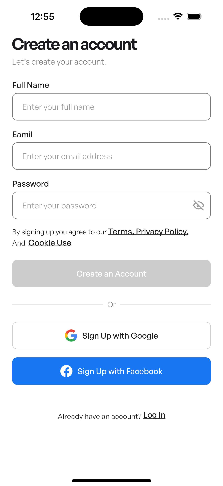<br/><sub><b>Sign Up</b></sub></td>
    <td align="center"><br/><sub><b>Forgot Password</b></sub></td>
  </tr>
</table>

---

### Home & Product Discovery

<table>
  <tr>
    <td align="center">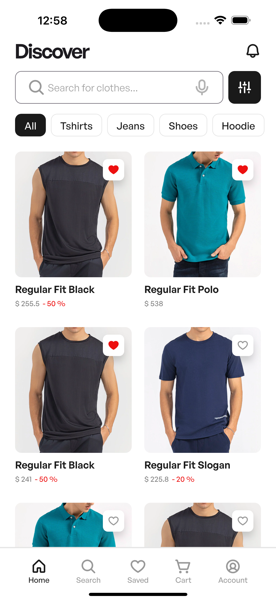<br/><sub><b>Home</b></sub></td>
    <td align="center">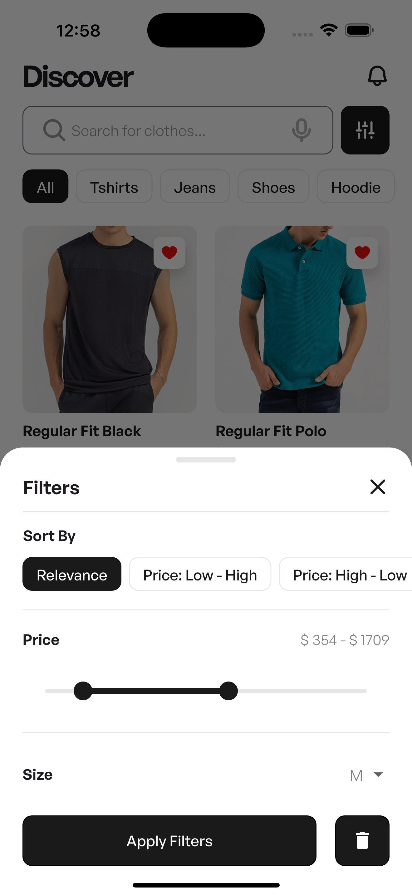<br/><sub><b>Products Filter</b></sub></td>
    <td align="center">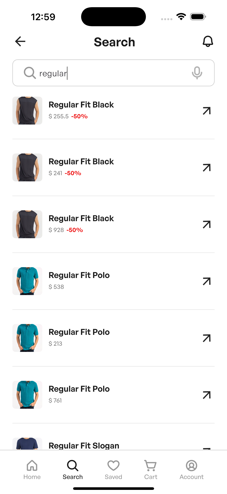<br/><sub><b>Search</b></sub></td>
  </tr>
</table>

---

### Product Details & Reviews

<table>
  <tr>
    <td align="center">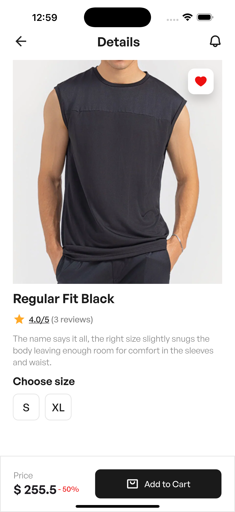<br/><sub><b>Product Details</b></sub></td>
    <td align="center">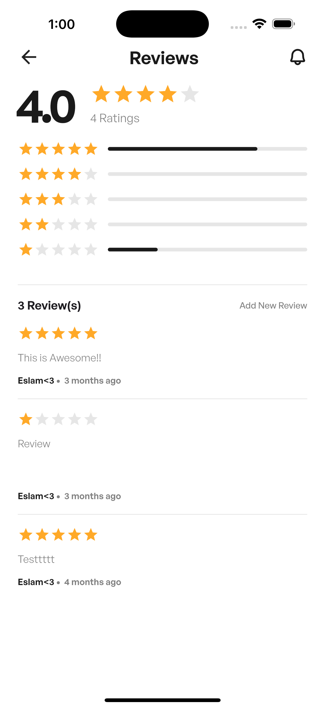<br/><sub><b>Reviews</b></sub></td>
  </tr>
</table>

---

### Wishlist & Cart

<table>
  <tr>
    <td align="center"><br/><sub><b>Wishlist</b></sub></td>
    <td align="center">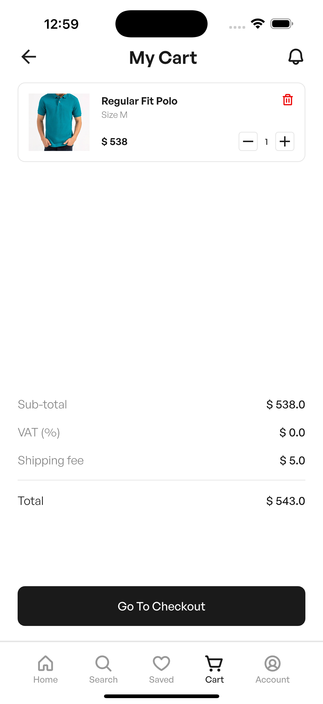<br/><sub><b>Cart</b></sub></td>
  </tr>
</table>

---

### Payment Methods

<table>
  <tr>
    <td align="center">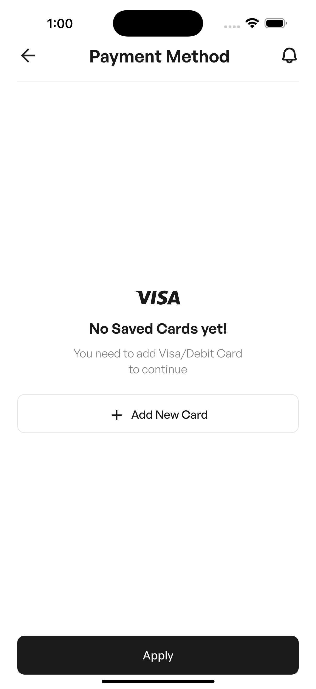<br/><sub><b>Payment Methods</b></sub></td>
    <td align="center">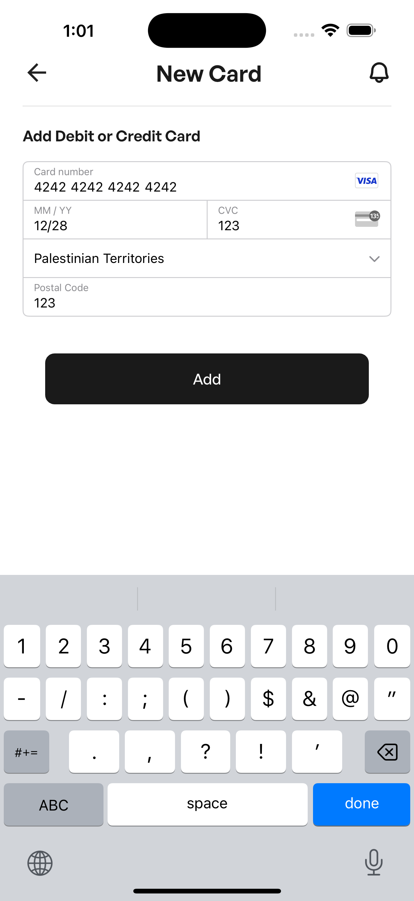<br/><sub><b>Add Payment Card</b></sub></td>
  </tr>
</table>

---

### Delivery Address

<table>
  <tr>
    <td align="center">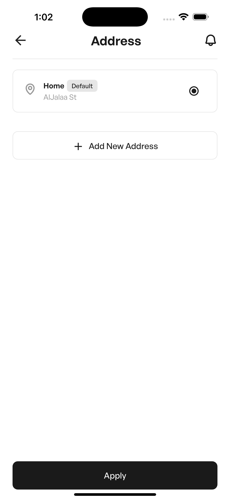<br/><sub><b>Saved Addresses</b></sub></td>
    <td align="center">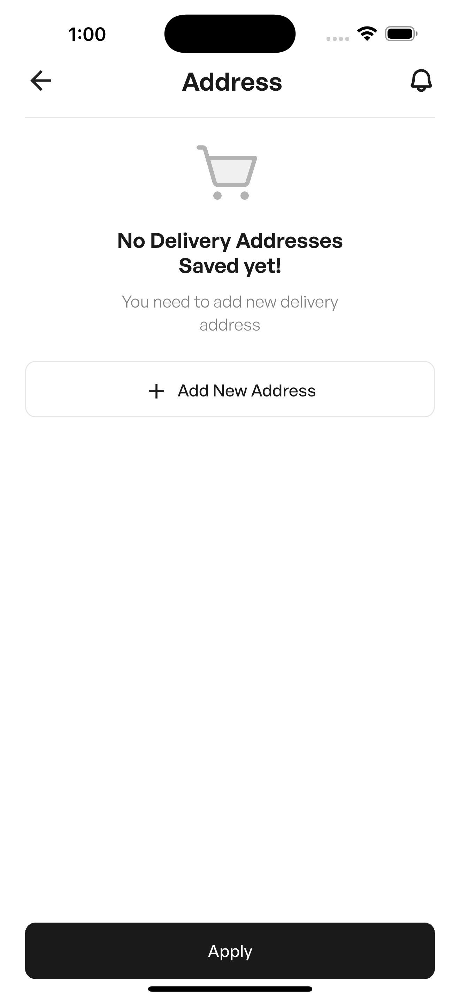<br/><sub><b>No Addresses</b></sub></td>
    <td align="center">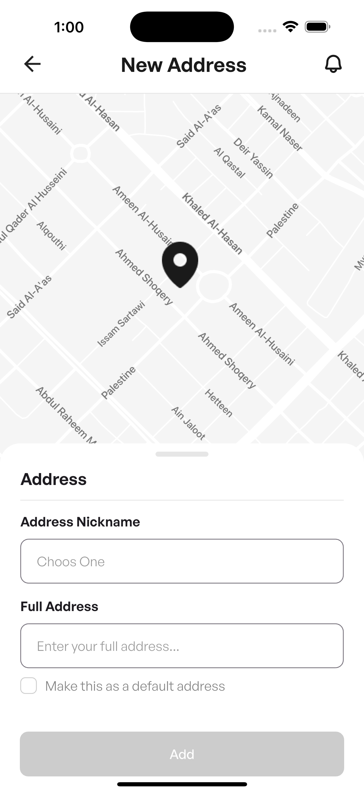<br/><sub><b>Add New Address</b></sub></td>
  </tr>
</table>

---

### Checkout & Account

<table>
  <tr>
    <td align="center">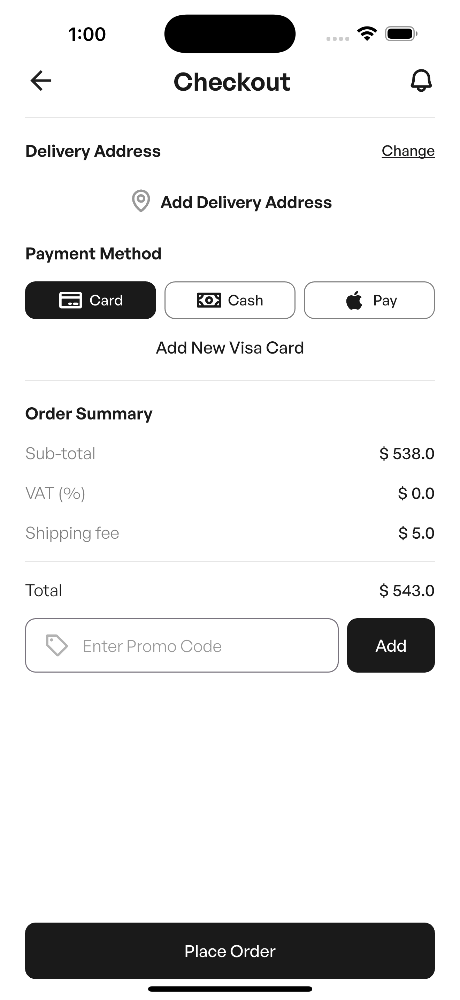<br/><sub><b>Checkout</b></sub></td>
    <td align="center"><br/><sub><b>Notifications</b></sub></td>
    <td align="center">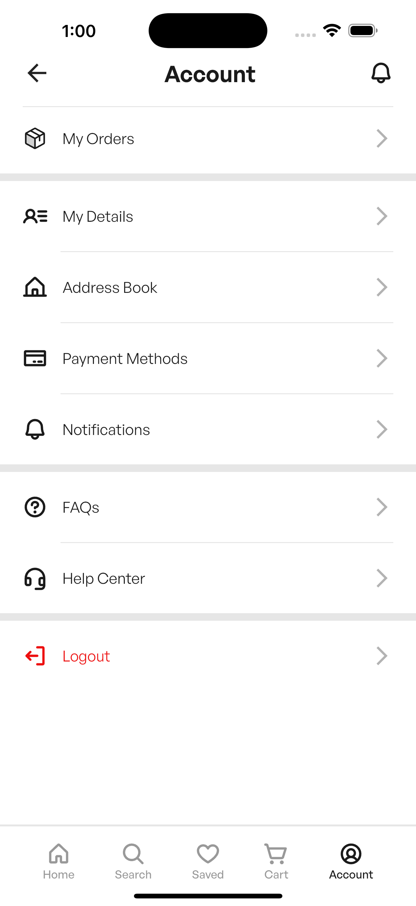<br/><sub><b>Account</b></sub></td>
  </tr>
</table>

<br/>

---

## Features

### Authentication & Onboarding
- Splash screen with session persistence via SharedPreferences
- Animated onboarding flow
- Email / Password sign-up and login
- Google Sign-In and Facebook Login (OAuth)
- OTP-based password reset with hashed code verification

### Shopping Experience
- Home feed with product listings fetched from Cloud Firestore
- Category filtering
- Full-text product search with recent search history
- Product detail page with image, price, size/color variants, and customer reviews
- Wishlist / Save for later

### Cart & Checkout
- Add to cart, adjust quantities, remove items
- Checkout flow with:
  - Saved delivery addresses (add / select / manage)
  - Google Maps integration — visualize delivery location with polyline routing
  - Device GPS via Geolocator
  - Multiple payment methods (Stripe card payments)
  - Add new credit/debit cards through Stripe
- Place order → stored in Firestore

### Orders & Account
- My Orders screen with order history
- My Details — view and update profile
- Notifications page
- FAQs and Help Center pages
- Logout

---

## Tech Stack

| Layer | Technology |
|---|---|
| UI Framework | Flutter 3 / Dart |
| State Management | flutter_bloc (Cubit) |
| Architecture | Clean Architecture (Data · Domain · Presentation) |
| Dependency Injection | get_it |
| Functional Programming | dartz (Either, Option) |
| Backend | Firebase (Auth, Cloud Firestore, Remote Config, Cloud Functions) |
| Payments | Stripe (flutter_stripe) |
| Maps & Location | Google Maps Flutter, Geolocator, flutter_polyline_points |
| Auth Providers | Google Sign-In, Flutter Facebook Auth |
| Networking | http |
| Image Loading | cached_network_image |
| Local Storage | shared_preferences |
| Network State | connectivity_plus |
| Vector Graphics | flutter_svg |
| Equality | equatable |

---

## Architecture

The project follows **Clean Architecture** with a feature-first folder structure. Each feature is self-contained across three layers:

```
lib/
├── core/
│   ├── di/              # GetIt service locator setup
│   ├── theme/           # Colors, text styles, app theme
│   ├── constants/       # Routes, cubit providers
│   ├── session/         # Auth session management
│   ├── errors/          # Failures & exceptions
│   └── widgets/         # Shared UI components
│
└── features/
    ├── welcome/         # Splash & onboarding
    ├── auth/            # Login, signup, OTP, password reset
    ├── home/            # Product listing, search, cart, wishlist
    ├── checkout/        # Address, payment, Stripe, Google Maps
    └── Order/           # Order history
```

Each feature contains:
- `Data/` — models, mappers, data sources, repository implementations
- `Domain/` — entities, repository interfaces, use cases
- `Presentation/` — screens, cubits, widgets

---

## Getting Started

### Prerequisites

- Flutter SDK `^3.10.1`
- Dart SDK `^3.10.1`
- A Firebase project with **Authentication**, **Firestore**, and **Remote Config** enabled
- A Stripe account — store the publishable key in Firebase Remote Config under the key `stripe_publishable_key`
- Google Maps API key configured for Android and iOS

### Installation

```bash
# Clone the repository
git clone https://github.com/eslammadhoun/shopy.git
cd shopy

# Install dependencies
flutter pub get

# Run the app
flutter run
```

> Make sure your `google-services.json` (Android) and `GoogleService-Info.plist` (iOS) are placed in their respective platform directories before running.

---

## Key Implementation Highlights

- **Remote Config for secrets** — Stripe publishable key is fetched at app startup from Firebase Remote Config, keeping sensitive keys out of source code.
- **OTP hashing** — Password-reset OTP codes are hashed with `crypto` before comparison, preventing plaintext exposure.
- **Dartz Either** — All repository and use-case return types use `Either<Failure, T>`, making error handling explicit and eliminating uncaught exceptions from business logic.
- **Connectivity awareness** — Network state is observed globally; offline states are handled gracefully.
- **Mapper pattern** — Separate mapper classes decouple Firestore models from domain entities, keeping the domain layer free of Firebase dependencies.

---

## Platforms Supported

- Android
- iOS

---

## License

This project is for portfolio and educational purposes.
